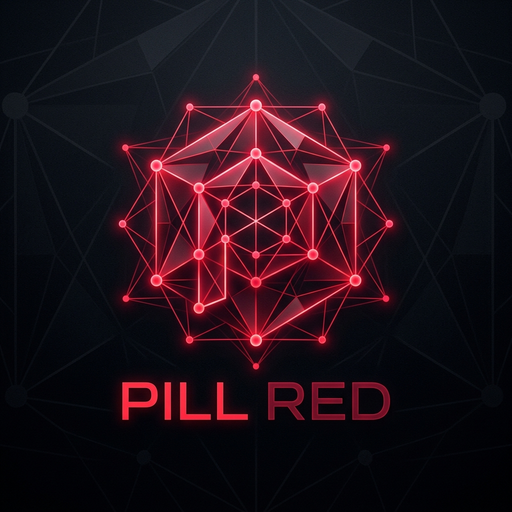

<div align="center">



# 🔴 PILL RED
### An Adversarial Study of Polynomial SAT Representations & Negative Results

[](src/)
[](pillred/)
[](LICENSE)
[](https://github.com/Jellyjam2/PILL-RED/releases)
[](src/)

---

</div>

## 🏛️ What This Project Actually Is

**PILL RED** is an open-source experimental and theoretical study investigating why non-classical representations (continuous spectral geometry, multilinear tensors, and discrete algebraic projections) fail to solve Boolean Satisfiability (SAT / $\mathbf{NP}$-complete) in polynomial time.

Rather than testing only random 3-SAT instances, the project constructs **controlled adversarial collision families** (e.g. Tseitin formulas on high-girth Ramanujan expanders and iso-algebraic parity pairs) where SAT and UNSAT instances are designed to share identical low-degree spectral or structural invariants.

The repository consists of two distinct parts:

```
                                  🔴 PILL RED
                                       │
        ┌──────────────────────────────┴──────────────────────────────┐
        ▼                                                             ▼
[PART 1: THE EXECUTABLE BENCHMARK SUITE]     [PART 2: THEORETICAL FEASIBILITY AUDITS]
• 5 Concrete Implemented Representations.    • 17 Paper-First Literature Audits.
• Python / Rust CLI & Benchmark Harness.     • Pre-experimental mathematical analysis.
• PySAT (Glucose3) Decision Profiler.        • No code written for algebraically doomed
• Native Rust linear algebra core.             theories (Rule 013: Paper-First).
```

---

## 💻 Part 1: Implemented Representations & Codebase Scope

The executable codebase (`src/`, `pillred/`) implements and benchmarks **5 concrete representation strategies**:

1. **Baseline CDCL:** Standard modern conflict-driven clause learning via PySAT (`Glucose3`).
2. **Continuous Graph Laplacians ($\mathbb{R}$):** Continuous clause-variable incidence relaxations ($\mathbf{L} = \mathbf{B}^T \mathbf{B}$), Fiedler vector extraction, and spectral symmetry-breaking predicates (SBPs).
3. **Discrete Linear Parity ($\mathbb{F}_2$):** Exact Gaussian elimination for affine XOR sub-clauses, performing variable condensation in $O(m n^2)$ time.
4. **Multilinear Tensor SVD ($\mathcal{T}$):** Multilinear tensor-rank factorizations for compressing higher-order clause hypergraphs.
5. **Valuation-Preserving Tensor-Ideals (VPTI):** Local witness-cut projection operators that evaluate subspace consistency on local subgraphs.

### Clarification on Tooling & Solver Backend:
* **Solver Backend:** All hybrid methods use `Glucose3` (via PySAT) as the underlying CDCL engine to measure whether algebraic/spectral preprocessing prunes decisions and conflict clauses.
* **Native Rust Core:** A high-performance C-ABI / PyO3 Rust extension (`src/lib.rs`) providing zero-copy symmetric eigen-decomposition and parallel stochastic annealing.

---

## 📚 Part 2: Theoretical Pre-Implementation Audits (Paper-First)

The `documentation/` directory contains 18 formal feasibility studies evaluating **17 proposed non-classical mathematical frameworks**:

* *Paradigms Audited on Paper:* Non-Abelian Gauge Holonomy ($S_3$), Cellular Sheaf Cohomology, Stanley-Reisner Syzygies, Tensor Networks (MPS/PEPS), Hamiltonian Monodromy, Hypergraph $p$-Laplacians, $p$-Adic Ultrametrics, Information Geometry (Fisher-Rao), Free Probability, Discrete Wigner Magic, Tropical Algebraic Geometry, Quantum Graphs (Trace Formulas), Étale Cohomology, Discrete Morse Theory, Sheaf Contextuality (Bell-KS), Dual Trace Invariants (Ihara-Bass), and Sequential Communication States.

### Why These Were Not Implemented in Code:
Under a strict **"Paper-First" rule**, each paradigm was subjected to an adversarial theoretical feasibility analysis against established theorems in proof complexity, algebraic geometry, and spectral graph theory. 

Because each approach was proven on paper to encounter fundamental structural barriers (such as the Bass-Hashimoto factorization, expander girth limits, or group equation $\mathbf{NP}$-completeness), they were **disqualified prior to implementation** to avoid writing speculative code for methods that were already mathematically non-viable.

---

## 🔬 Key Empirical & Theoretical Findings

```
                         THE OBSERVED TRILEMMA
                                   │
    ┌──────────────────────────────┼──────────────────────────────┐
    ▼                              ▼                              ▼
[OUTCOME A: COLLAPSE]      [OUTCOME B: CIRCULARITY]       [OUTCOME C: BLOWUP]
Tractable relaxations      Exact discrete logic is        Exact continuous/algebraic
(spectral, linear, LP)     retained, but constructing     representations require
lose global parity on      the invariant requires         exponential resources
high-girth expanders.      solving an NP-hard search.     (dimension, precision, orbits).
```

### 📊 Data Scale & Experimental Scope Notice:
* **Micro-Benchmark Sample Sizes ($N = 3 \text{ to } 10$):** Empirical runs in v1.0 represent proof-of-concept demonstrations on small batches of generated instances (e.g. 10 computed collision pairs in Phase 17; expander conflict scaling on 10 pairs in Phase 18). They are intended as targeted micro-benchmarks rather than large-scale statistical studies.
* **Pilot vs. Computed Phases:** Specific phases (e.g. Phase 17 VPTI and Phase 18 expander crucible) contain computed JSON datasets with conflict/valuation metrics; intermediate phases (Phases 11–16) served as exploratory pilot sweeps where qualitative behaviors were identified interactively.
* **Motivation for v2.0:** This exact sample-size limitation motivates the automated architecture of v2.0, which replaces manual small-batch testing with autonomous, large-scale ($N = 100 \text{ to } 1000$) instance generation and logging.

### Summary of Observed Behaviors:
1. **Linear $\mathbb{F}_2$ Elimination vs. Non-Linear Degree:**  
   Gaussian elimination resolves pure parity (XOR-SAT) in $O(n^3)$ with $100\%$ variable condensation, but its effectiveness drops to $0.0\%$ once non-linear clauses of degree $d \ge 2$ are introduced.
2. **Local Projector Blindness on High-Girth Expanders:**  
   Valuation-preserving projectors (VPTI) separate local witness cuts, but are completely blind ($\Delta_{\text{val}} = 0$) on Ramanujan expander collision pairs with girth $g \ge 5$, where local neighborhoods are acyclic trees.
3. **No Solution to $P \stackrel{?}{=} NP$:**  
   The project does not claim $P = NP$, $P \neq NP$, or a universal polynomial-time SAT solver. The general $\mathbf{P} \stackrel{?}{=} \mathbf{NP}$ question remains **completely open**.

---

## 🚀 Quickstart: Running the Benchmark Suite

### Prerequisites
* Python 3.10+
* Rust 1.75+ (Cargo)
* Dependencies: `numpy`, `scipy`, `python-sat`

### 1. Execute Adversarial Collision Benchmarks
```bash
# Test Valuation-Preserving Tensor-Ideals (VPTI) on High-Girth Expanders (g >= 5)
python pillred_cli.py crucible --family high_girth_expander --candidate vpti --samples 5

# Test Tensor Rank SVD on Quadratic / Cubic Iso-Algebraic Pairs
python pillred_cli.py crucible --family iso_pairs --candidate tensor --samples 5
```

### 2. Replicate Empirical Phases
```bash
# Replicate Phase XIV: Dual-Field Decomposition (Linear Parity Condensation)
python pillred_cli.py replicate --phase 14

# Replicate Phase XVII: Valuation-Preserving Projectors
python pillred_cli.py replicate --phase 17

# Replicate Phase XVIII: High-Girth Expander Collision Benchmark
python pillred_cli.py replicate --phase 18
```

---

## 📁 Repository Structure

```
PILL RED v1.0.0
├── benchmarks/         # Standard benchmark harnesses for Phases I–XVIII
├── documentation/      # 18 Theoretical Feasibility Studies & Literature Reviews
│   ├── THEORETICAL_AUDIT_LEAD_001_NON_ABELIAN_HOLONOMY.md
│   ├── ... (Feasibility studies for Leads 02 through 17)
│   ├── THEORETICAL_META_AUDIT_VERIFICATION_017.md        # Mathematical premise verification
│   └── THEORETICAL_SYNTHESIS_AND_TERMINATION_ANALYSIS.md # Termination analysis & Trilemma synthesis
├── discoveries/        # 11 Logged empirical observations (DISCOVERY-001..011)
├── falsifications/     # 5 Logged empirical falsifications (FALSIFICATION-001..005)
├── experiments/        # 17 Controlled experimental records (EXP-001..EXP-PHASE18)
├── evidence/           # Raw JSON datasets, benchmark outputs, and diagnostic visualizers
├── pillred/            # Python package implementing the 5 candidate representations
├── pillred_cli.py      # Unified CLI entry point for benchmark replication
└── src/                # Native Rust core (Laplacian linear algebra FFI & parallel annealing)
```

---

## ⚖️ License

PILL RED is released under the **Apache 2.0 / MIT Dual License**. All research artifacts, datasets, and theoretical records are permanently archived and frozen under Git version control.
